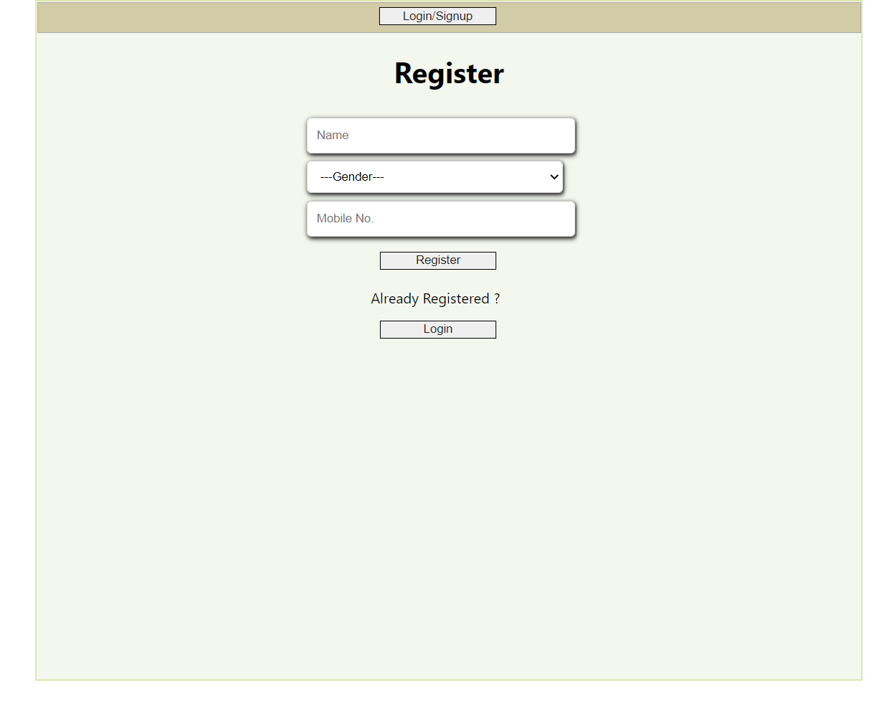
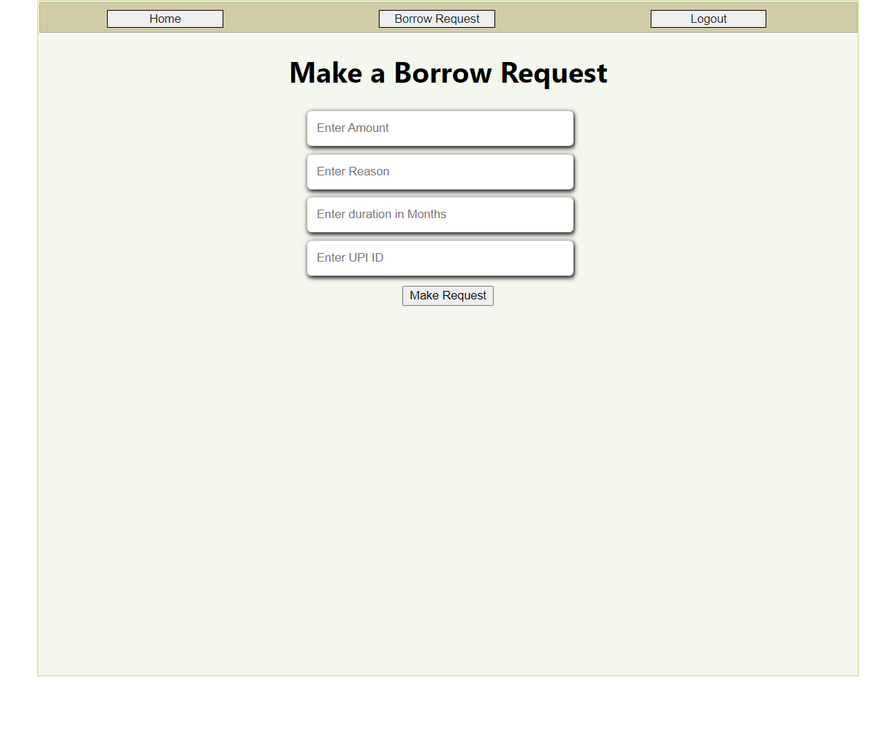
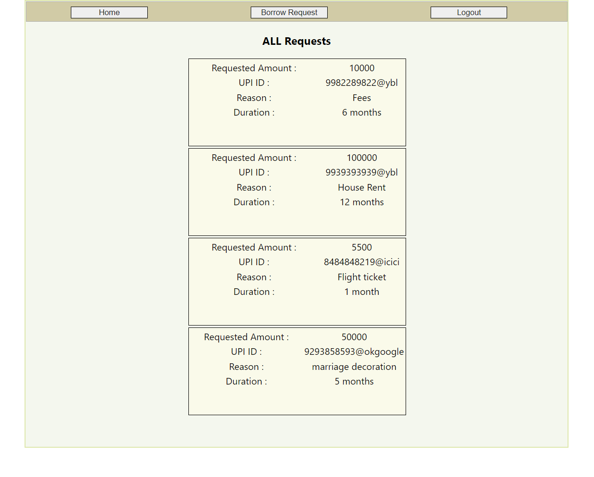

This project requires the following software to be intstalled on your system

NodeJS / NPM - https://nodejs.org/en/
Git - https://git-scm.com/downloads
Getting a copy of this starter
You can simply fork this folder to start working on it.

To push your changes to Github/Gitlab you need to create a new repository and push the changes there.

## Setup instructions for Backend

Open a teminal and move into the backend directory
then run the following command

```
backend
    src
        index.js -> handles all backend requests 

frontend
    src
        components -> create and store components here
        pages -> create and store pages here
        utils -> create and store utilities here 
```

Edit the variables in `.env` file you just created.
The secret key can be any random string.
The rest are specific to you.


## Opening development server

```
srver -> run npm init to start dev server for backend

client -> npx create-react-app to start a frontend
```

This will start a development server at [localhost:3001](localhost:3001) for backend
This will start a development server at [localhost:3000](localhost:3000) for frontend


## Database management

This repo used MongoDB Atlas.
To connect you backend to database( 
https://www.mongodb.com/ )  update .env file by your backend url

write following code in index.js

```
mongoose
  .connect(process.env.MONGODB_URL)
  .then(() => {
    console.log("DB is connected .......");
  })
  .catch((err) => {
    console.log(err);
  });
  ```


## Setup instructions for Frontend

Move into the frontend directory and first install the node modules by running

### `npm install`

In the project directory, you can run:

### `npm start`

Runs the app in the development mode.\
Open [http://localhost:3000](http://localhost:3000) to view it in the browser.

The page will reload if you make edits.\
You will also see any lint errors in the console.


## Setup instructions for the Server

Since the app is built into two separate Frontend and Backend modules,
it is required to be hosted from a single server name.
Otherwise, problems regarding CORS will hinder Authentication services.

We use express to serve the frontend and the backend on the same server name.

```
const express = require("express");
const cors = require("cors");
const app = express();
app.use(cors());

```


# PREVIEW

Following are some of the features of the application

## Registration page



## Borrow Request page



## All Requests made




